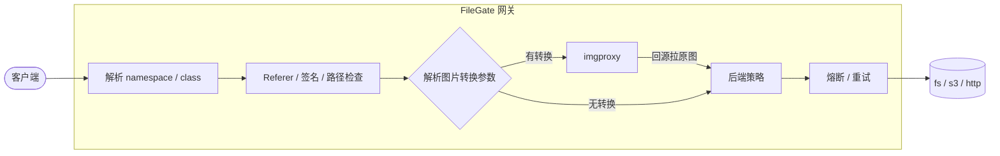

# FileGate


FileGate 是一个用 Go 和 Gin 写的文件处理中间件。

它负责把文件请求转发到不同的存储后端。后端可以是本地文件系统、S3 兼容存储，也可以是另一个 HTTP 服务。文件访问本身之外，还可以按配置做访问控制、后端切换以及图片转换。


## 目录

* [工作原理](#工作原理)
* [请求 URL 格式](#请求-url-格式)
* [安装与构建](#安装与构建)
* [快速开始](#快速开始)
* [配置说明](#配置说明)
* [HTTP API](#http-api)
* [安全机制](#安全机制)
* [可观测性](#可观测性)
* [项目结构](#项目结构)

---

## 工作原理

一个普通的文件请求大致会经过下面这条链路：



启动时，`FileGate`会把配置中的 `namespace`、`class` 和后端策略整理好，请求进来后直接根据路由找到对应配置。

如果请求带了图片转换参数，则交给 imgproxy；否则直接从后端读取文件。后端发生错误时，根据配置的策略决定是否换下一个后端。

主要代码大致分为几块：

| 组件             | 作用                                                  |
| ---------------- | ----------------------------------------------------- |
| `Router`         | 根据 namespace / class 找到对应配置，预编译路径过滤器 |
| `PolicyEngine`   | 决定请求使用哪些后端，并处理熔断                      |
| `Processor`      | 解析请求路径和图片转换参数                            |
| `Backend`        | 统一 `fs`、`s3`、`http` 三种后端的访问方式            |
| `Middleware`     | `Referer`、签名和路径过滤                             |
| `imgproxyClient` | 生成`imgproxy`请求并把结果转回客户端                  |

## 请求 URL 格式

主要接口：

```text
GET  /fs/{namespace}/{class}/{objectPath}
HEAD /fs/{namespace}/{class}/{objectPath}
```

### 直接访问（不转换）

不携带转换参数时，直接按 `objectPath` 从后端拉取原文件：

```text
/fs/namespace1/class1/images/photo.jpg
```

### 图片转换

在 `objectPath` 末尾追加以 `@` 分隔的**转换后缀**：
```text
/fs/{namespace}/{class}/{objectPath}@[<参数>...][.<格式>]
```

参数之间使用 `_` 分隔，顺序没有要求，也可以只写其中一部分。

| 参数        | 含义                     | 示例                |
| --------- | ---------------------- | ----------------- |
| `!{rule}` | 使用哪个转换规则               | `!png_conversion` |
| `<数字>w`   | 宽度，单位像素                | `320w`            |
| `<数字>h`   | 高度，单位像素                | `240h`            |
| `<数字>b`   | 模糊程度，数值除以 10 后作为 sigma | `5b`              |
| `<数字>q`   | 图片质量，1–100             | `80q`             |
| `.{格式}`   | 输出格式                   | `.webp`           |

其中转换规则是可选的。宽度、高度等参数可以省略，省略时依次使用规则 `params`、类别 `default_params` 中的默认值。

例如：

```text
# 使用 png_conversion，宽 320，质量 70，输出 webp
/fs/namespace1/class1/images/photo.jpg@!png_conversion_320w_70q.webp

# 只指定高度和输出格式
/fs/namespace1/class1/avatars/u1.png@!png_conversion_600h.avif

# 不指定规则，仅覆盖宽度，其余参数取类别 default_params
/fs/namespace1/class1/images/photo.jpg@320w
```

也可以使用查询参数：

```text
?rule=&width=&height=&quality=&blur=&format=
```

如果路径后缀和查询参数同时指定了同一个字段，并且值不同，会返回 `400`。

`enable_request_params` 没有开启的参数会被忽略。不存在的转换规则会返回 `400`。

需要注意，图片转换依赖 `service.imgproxy.url`。如果没有配置 imgproxy，带转换参数的请求不会报错，而是直接回源读取原文件。

## 安装与构建

需要 Go 1.25 或更新版本。

```bash
go build -o filegate ./cmd/server/
```

运行：

```bash
./filegate -config config.yaml
```

配置文件默认使用当前目录下的 `config.yaml`，也可以通过 `-config` 指定其他文件。

版本号可以在构建时注入：

```bash
go build -ldflags="-s -w -X github.com/thun888/filegate/internal/server.Version=v1.2.3" ./cmd/server/
```

## 快速开始

先准备配置文件

```bash
mv config.example.yaml config.yaml
```


一个最简单的本地文件配置如下：

```yaml
backends:
  - name: "local"
    type: "fs"
    config:
      root_path: "/data/files"

backend_policy:
  - name: "default"
    strategy: single
    backends:
      - local

namespaces:
  - name: "ns1"
    backend_policy: "default"
    class:
      - name: "images"
system:
  server:
    host: 127.0.0.1
    port: 8080
```

启动：

```bash
./filegate -config config.yaml
```

然后可以测试：

```bash
curl http://127.0.0.1:8080/ping

curl http://127.0.0.1:8080/fs/ns1/images/photo.jpg
```

## 配置说明

完整配置可以参考 [`config.example.yaml`](config.example.yaml)。

配置中的 `backend`、`policy`、`rule`、`namespace` 等名称匹配时不区分大小写。

### 配置结构

```text
backends[]
  └─ 后端存储（fs / s3 / http）
       └─ timeout / retries / retry_delay / circuit_breaker

backend_policy[]
  └─ 后端调度策略
       └─ backends[] → 引用 backends[].name

namespaces[]
  └─ namespace
       └─ backend_policy → 引用 backend_policy[].name
            └─ class
                 ├─ security
                 ├─ file_conversion
                 └─ response_headers

file_conversion_rules[]
  └─ 图片转换规则

service.imgproxy
  └─ imgproxy 配置

system
  ├─ server
  ├─ logging
  └─ metrics
```

### backends

三种后端的配置方式略有不同，但重试、超时和熔断配置是共用的。

```yaml
backends:
  - name: "backend1"
    type: "http" # fs | s3 | http

    config:
      # http
      url_prefix: "http://upstream:8080"
      extra_headers:
        X-Example: "value"

      # s3
      endpoint: "s3.amazonaws.com"
      region: "us-east-1"
      bucket: "my-bucket"
      access_key: ""
      secret_key: ""

      # fs
      root_path: "/data/files"

    timeout: 5s
    retries: 3
    retry_delay: 1s

    circuit_breaker:
      failure_threshold: 5
      recovery_timeout: 30s
      half_open_timeout: 10s
```

各后端需要的配置：

* `fs`：必须有 `config.root_path`
* `http`：必须有 `config.url_prefix`
* `s3`：必须有 `config.bucket`
* `s3` 使用认证时，`access_key` 和 `secret_key` 必须同时配置

重试只发生在单个后端内部。比如一个后端配置了 `retries: 3`，三次都失败后，才会把这个后端判定为失败，然后根据策略尝试下一个后端。

熔断器只有在 `failure_threshold > 0` 时才会启用。

### backend_policy

```yaml
backend_policy:
  - name: "policy1"
    strategy: fallback
    backends:
      - backend1
      - backend2
```

`backends` 的顺序就是优先级。

| strategy      | 行为              |
| ------------- | --------------- |
| `single`      | 只使用第一个后端        |
| `fallback`    | 按顺序尝试后端，成功后停止   |
| `priority`    | 和 `fallback` 相同 |
| `round_robin` | 在多个后端之间轮流使用     |
| `random`      | 随机决定后端顺序        |

`round_robin` 的状态保存在进程内，服务重启后会重新开始。

### namespaces / class

`namespace` 和 `class` 最终会直接出现在 URL 中：

```text
/fs/{namespace}/{class}/{objectPath}
```

例如：

```yaml
namespaces:
  - name: "namespace1"           # 命名空间名称
    backend_policy: "policy1"    # 使用的后端策略

    class:
      - name: "class1"           # 子类别

        security:
          # Referer 检查：按 Referer 提取的域名匹配（忽略协议、端口、路径）
          refer_check:
            enabled: true
            allowed_referers:
              - "example.com"    # 精确域名
              - "*.another.com"  # 泛域名，匹配所有子域名（不含基域名本身）
              - "*"              # 单独的 * 放行所有域名
            # 注意：enabled 为 true 但列表为空时，所有请求都会被拒绝（403）

          # URL 签名（HMAC-SHA256），客户端通过 ?exp=<秒>&sign=<值> 传递，见“安全机制 - URL 签名”
          signature:
            enabled: true
            secret: "xxxx"       # 签名密钥，启用时必填
            expire: 300          # exp 允许的最大超前窗口（秒），0 表示不限制

          # 路径过滤，检查顺序：deny_patterns → allow_paths → allow_extensions
          path_filter:
            deny_patterns:       # 字面量子串匹配（非正则），路径包含任一条目即拒绝
              - "../"
              - ".git"
            allow_paths:         # 非空时，路径必须命中其中一个前缀
              - "images/"
              - "avatars/"
            allow_extensions:    # 非空时，文件扩展名必须命中其中之一
              - "jpg"
              - "png"
              - "webp"
            # 三项全为空表示全部放行

        # 图片转换配置
        file_conversion:
          rules:                 # 可用转换规则白名单，引用 file_conversion_rules[].name
            - "png_conversion"

          # 类别级默认参数，规则 params 未设置对应字段时生效（0 / 空串视为未设置）
          default_params:
            width: 800           # 默认宽度（像素）
            height: 600          # 默认高度（像素）
            blur: 0.5            # 高斯模糊 sigma，0 表示不模糊
            quality: 80          # 图片质量，1–100
            format: "avif"       # 输出格式

          # 允许通过请求（query / 路径后缀）覆盖的字段开关及取值范围
          enable_request_params:
            width: { enabled: true, min: 1, max: 8192 }
            height: { enabled: true, min: 1, max: 8192 }
            quality: { enabled: true, min: 10, max: 95 }
            blur: true           # blur 与 format 为 bool 开关
            format: true
            # 未启用的字段会被静默忽略；取值超出 min/max 时返回 400

        # 自定义响应头，文件访问成功时随响应一起返回
        response_headers:
          Cache-Control: "public,max-age=3600"
```

### file_conversion_rules

转换规则定义图片转换时的默认参数以及一些额外处理。

```yaml
file_conversion_rules:
  - name: "png_conversion"    # 规则名称

    # 源文件大小上限（如 "100MB"），用于 imgproxy 侧处理
    # 不填写单位默认为字节
    max_file_size: "100MB"

    # 规则级默认参数，覆盖类别 default_params 中已设置的对应字段（0 / 空串视为未设置）
    params:
      width: 800              # 默认宽度（像素）
      height: 600             # 默认高度（像素）
      blur: 0.5               # 高斯模糊 sigma，0 表示不模糊
      quality: 80             # 图片质量，1–100
      format: "avif"          # 输出格式

    # 附加处理参数：按 "/" 拆分为选项段，原样前置到 imgproxy 处理 URL 开头（先于其他处理参数生效）
    # 段内仅允许字母、数字与 _ : . - 字符，如 "strip_exif/w:600/q:50/f:avif"
    extra_params: ""

    # 水印，需要在 imgproxy 端配置对应的水印图片
    watermark:
      enabled: true
      opacity: 0.5            # 透明度，范围 [0,1]（启动时校验）
      position: "soea"        # ce(居中), no(顶部), so(底部), ea(右边), we(左边), noea(右上), nowe(左上), soea(右下), sowe(左下), re(平铺), ch(棋盘格平铺)
      x_offset: 0             # X 偏移：>=1 或 <=-1 为绝对像素值，(-1,1) 为相对值；position 为 re/ch 时表示瓦片间距
      y_offset: 0             # Y 偏移：>=1 或 <=-1 为绝对像素值，(-1,1) 为相对值；position 为 re/ch 时表示瓦片间距
      scale: 0                # 水印大小相对结果图片的比例，0 表示不改变大小
```

参数取值优先级：请求参数（query / 路径后缀）> 规则 `params` > 类别 `default_params`。
规则 `params` 只覆盖类别 `default_params` 中已设置的对应字段（0 / 空视为未设置，沿用类别默认值）。

`extra_params` 会按照 `/` 拆分成参数段，并原样放到 imgproxy 处理 URL 中。

水印需要同时在 imgproxy 端配置对应的水印图片。

### service / system

```yaml
service:
  imgproxy:
    url: ""                 # imgproxy 服务地址，未配置时图片转换不生效，直接回源读原文件
    timeout: 20s            # imgproxy 请求超时，<=0 时按默认 20s

    # imgproxy URL 签名，enabled 时 key 与 salt 必填（启动校验），且须与 imgproxy 服务端一致
    signature:
      enabled: false
      key: ""
      salt: ""

system:
  server:
    base_url: "http://127.0.0.1:8080"  # imgproxy 回源使用的地址，未配置时由 host:port 推导
    host: 0.0.0.0                      # 监听地址
    port: 8080                         # 监听端口
    debug: false                       # true 用 gin.DebugMode，false 用 gin.ReleaseMode

  logging:
    level: info      # 日志级别：debug, info, warn, error
    access_log: true # 是否输出 Gin 访问日志

  metrics:
    prometheus: true # 是否启用 /metrics 端点
```

`system.server.base_url` 是 imgproxy 回源时使用的地址。如果 FileGate 在容器或反向代理后面运行，这里应该填写 imgproxy 能访问到的地址，而不是随便填写一个客户端地址。

`system.server.debug` 控制 Gin 使用 DebugMode 还是 ReleaseMode。

`system.metrics.prometheus` 控制 `/metrics` 是否启用。

## HTTP API

| 方法             | 路径                                      | 说明              |
| -------------- | --------------------------------------- | --------------- |
| `GET` / `HEAD` | `/fs/:namespace/:class/*objectPath`     | 文件访问，可选图片转换     |
| `GET` / `HEAD` | `/origin/:namespace/:class/*objectPath` | 给 imgproxy 回源使用 |
| `GET`          | `/ping`                                 | 测试并返回版本信息          |
| `GET`          | `/healthz`                              | 健康检查            |
| `GET`          | `/metrics`                              | Prometheus 指标   |

`/origin/` 是给 imgproxy 回源用的接口。它只进行路径过滤，不检查 Referer 和 URL 签名，应在反向代理层限制访问来源。

常见响应头：

| 响应头                    | 说明                                |
| ---------------------- | --------------------------------- |
| `X-Request-Id`         | 请求 ID，可以由客户端提供，也可以由 FileGate 自动生成 |
| `X-FileGate-Policy`    | 当前请求使用的后端策略                       |
| `X-FileGate-Transform` | 实际使用的图片转换参数                       |

错误响应方面：

* `403`、`404` 和 `5xx` 会返回对应的错误图片（PNG）
* 其他错误返回 JSON，例如 `{"error":"..."}`
* `HEAD` 请求不会返回响应体

## 安全机制

### Referer

可以根据 Referer 限制文件的访问来源。

支持：

```text
example.com       精确域名
*.example.com     子域名
*                 全部允许
```

### URL 签名

FileGate 支持 HMAC-SHA256 URL 签名。

请求中通过：

```text
?exp=<秒>&sign=<值>
```

传递签名和过期时间。

签名使用的内容为：

```text
METHOD
PATH
QUERY
EXPIRE
```

然后使用配置中的 `secret` 计算 HMAC-SHA256。

### 路径过滤

路径过滤依次检查：

```text
deny_patterns
    ↓
allow_paths
    ↓
allow_extensions
```

检查的是去掉图片转换后缀之后的真实文件路径。

例如：

```text
photo.jpg@100w.jpg
```

不会因为最后的 `.jpg` 而绕过原始文件路径的扩展名限制。

路径还会经过 URL 解码和清洗，用来处理双重编码、`..` 等路径穿越情况。

### imgproxy 签名

如果开启 imgproxy 签名，FileGate 会给发送给 imgproxy 的处理 URL 加上 HMAC 签名。

`key` 和 `salt` 必须和 imgproxy 服务端保持一致。

> `/origin/` 不执行 Referer 和 URL 签名校验，只执行路径过滤。部署时请务必限制这个接口的访问来源。

## 可观测性

FileGate 没有单独的日志系统，主要还是使用标准日志输出。

### 请求 ID

每个请求都会有一个 `X-Request-Id`。

如果客户端已经提供，就直接使用；否则由 FileGate 生成。

日志会带上这个 ID，方便把同一个请求经过不同处理阶段的日志串起来。

### 调试模式

设置：

```bash
export FILEGATE_DEBUG=1
```

启动后，会额外输出当前实际生效的路由、后端和 imgproxy 配置，请求进入处理流程时也会打印更多信息。

这个模式主要用于排查配置和请求问题。

### 访问日志

可以通过：

```yaml
system:
  logging:
    access_log: true
```

控制 Gin 的访问日志。

### Prometheus

开启：

```yaml
system:
  metrics:
    prometheus: true
```

之后可以通过：

```text
GET /metrics
```

获取指标。

除了 Prometheus 默认指标之外，还会提供熔断器相关指标，例如：

```text
filegate_circuit_breaker_*
```

## 项目结构

```text
.
├── cmd/server/main.go          # 程序入口
├── config/                     # 配置加载、校验和解析
│   ├── config.go
│   ├── loader.go
│   └── extra_params.go
├── internal/
│   ├── backend/                # fs / s3 / http 后端和重试
│   ├── engine/                 # Router / PolicyEngine / Processor
│   ├── middleware/             # Referer / 签名 / 路径过滤
│   ├── server/                 # Gin 服务、路由、Handler、imgproxy
│   └── utils/                  # 路径处理、字节大小换算等
├── config.example.yaml         # 配置示例
└── go.mod
```